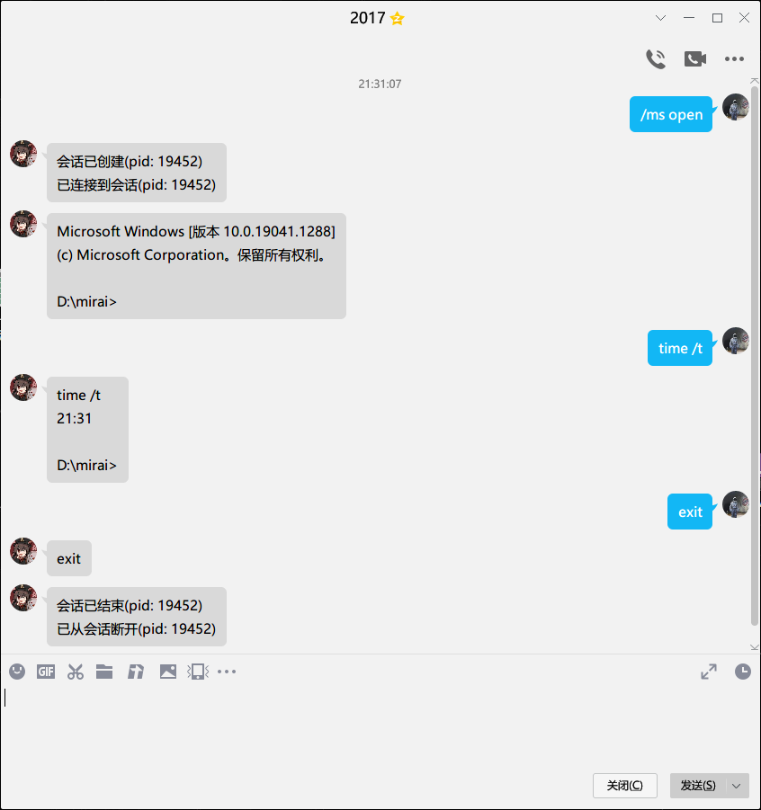

# MShell

> 一个[Mirai](https://github.com/mamoe/mirai)机器人插件，用来连接QQ聊天窗口和系统Shell

> 整篇文档篇幅较长，请善用目录功能

删掉了/ms auth

利用QQ的聊天功能，连接一个自定义子进程（一般是shell程序），然后就可以做任何事情了（其实是有限制的，具体可以[参考这里](#MShell插件的限制)）

适用场景：

+ 利用`cmd.exe`、`pwsh.exe`、`bash`、`sh`等shell程序运行一些简单的命令
+ 用[Rcon](https://github.com/Tiiffi/mcrcon)管理Minecraft后台
+ 写一个简单的Python程序做定时提醒或者监控程序

Gif演示：[主功能演示.gif](docs/assets/demonstrate.gif)、[共享控制权.gif](docs/assets/shared.gif)、[群聊会话.gif](docs/assets/group-session.gif)



## 安全风险说明

因为MShell插件和系统底层相连，其风险远大于普通Mirai插件。因此请严格控制权限的分配，不要给陌生人任何权限。如果非常在意，请打开**设备锁**等多种账号安全机制尽可能地降低安全风险

## 使用限制

### a.仅支持内置权限管理实现

因为mirai-console的权限相关的抽象接口里没有`根据某个权限获取拥有此权限的人的列表`这个API，所以我使用了Java反射机制来实现这个效果。我仅对`BuiltInPermissionService`（内置的默认权限管理系统）做了适配，这意味着如果你在使用其它权限管理类，那么插件会无法启动。所以尽可能使用内置权限管理系统

### b.不支持全屏类应用程序

受QQ限制，MShell插件不支持全屏类应用程序，比如vim、nano编辑器和top等需要进入全屏状态的程序

如果执意执行，则程序的每一帧画面都会被完整地发到聊天窗口中，会造成消息刷屏，具体频率和应用程序的刷新率有关（如果误进入，请使用窗口抖动/戳一戳消息来切断回话）

对于进度条类非全屏应用程序，比如apt，apt-get，pip install等，也会回显每一帧进度条的变化。如果进度条变化非常快，同样也会造成刷屏，因此请酌情使用

## 概念

在开始使用之前，有一些很简单的概念需要明白。

### 会话（Session）

在MShell中，每一个启动的子进程都会被封装成一个个会话进行管理，你可以粗略地认为`会话 = 子进程`。

每个会话都有一个独一无二的的PID，有了会话的PID我们就可以对会话进行各种操作了

### 连接（Connection）

每当有人连接到一个会话上时，就会产生一个与之对应的连接，当从一个会话上断开时，这个连接也会随之失效

每一个会话都支持多人同时连接（所有人共享控制权），但每个人同一时间只能连接到一个会话上

### 环境预设（Preset）

环境预设是一个配置项目，包含了子程序启动所必要的东西，比如启动命令行，工作目录，环境变量，PTY参数等

启动命令行不一定非得设置为`cmd.exe`、`pwsh.exe`、`bash`、`sh`，你同样可以直接指向一个具体的可执行文件

### 用户（User）

这里的用户是指MShell用户。MShell用户指的是一个QQ好友，或者一个QQ群聊。但如果你和机器人不是好友关系，则不能算是用户（下文中的`用户`均代指MShell用户）

MShell不会响应任何陌生人消息、临时会话（同一个mirai-console进程上的不同bot间的共同好友，也视作是同一用户）

## 基础教程

指令参数说明：以尖括号`<>`包裹的参数为必填参数，以方括号`[]`包裹的参数为选填参数

### 0.基本用法

首先将插件放到Mirai-console的插件目录里，重新启动Mirai，使其加载MShell插件

接下来，在后台创建一个环境预设，使用指令：`/ms preset add <preset> <charset> <shell>`

+ `<preset>`：预设的名字，可以随意取
+ `<charset>`：预设的字符集，一般可以选`utf-8`或者`gb2312`或者`gbk`，如果选错中文会乱码
+ `[shell]`：预设的启动命令行，Windows可以选`cmd.exe`、`powershell.exe`，Linux可以选`bash`、`sh`、`zsh`

环境预设创建好以后，需要给自己MShell管理员权限。没有权限的话是没法使用MShell插件的

首先加机器人为QQ好友。然后在后台使用`/ms auth add <qq>`给自己添加权限。

成为管理员以后，对bot发送QQ消息`/ms open [preset]`来启动一个新的会话，`[preset]`是你在第一步里填的预设的名字。（如果你总共只有一个预设的话，`[preset]`参数可以省略掉，可以偷懒）

如果一切正常，bot会返回这些信息：`会话已创建且已连接 19422（preset）`，代表会话启动成功，19422代表会话的PID，后面会用到。括号里的preset代表这个会话的预设名。

现在你已经连接到了会话上，接下来你发送的QQ消息就会被转发给程序了（透传模式）

我们可以给bot发送`dir`（Win）或者`ls`（Linux），输入好后点击发送按钮，就会列出当前目录下的文件列表了

如果需要结束会话，你可以给bot发送`exit`（Win或者Linux通用）来退出。如果遇到卡死无法正常退出，你可以使用戳一戳消息来暂时切断与会话的连接，并使用会话管理指令来强制结束这个回话

### 1.戳一戳消息

戳一戳消息，PC端叫窗口抖动。可以用来执行一些特殊操作

**在使用戳一戳消息时，如果你已经连接到了一个会话上**：

断开与当前会话的连接。注意，会话此时会转入后台运行，并未真正退出。

**在使用戳一戳消息时，如果你还未连接到会话上**：

重连回刚刚断开的会话。若无法重连，则会新建一个会话（以默认环境预设），相当于使用了`/ms open`指令

### 2.会话管理

断开与会话的连接并不会导致会话终止，会话会转入后台运行。你可以随时使用消息或者指令来恢复与会话连接

如果遇到会话卡死无法使用`exit`正常退出，可以使用戳一戳消息（PC端叫窗口抖动）先断开与会话的路连接，然后使用`/ms kill <pid>`来强制结束正在运行的会话，其中PID会在断开会话的提示里中出现一次，很容易找到

每开一个会话都会占用一些系统资源，所以不要接连不断地开新会话。如果不用的话，记得将会话退出运行。

你可以使用指令`/ms list`查看当前都有哪些会话，以及对应PID，和会话在线用户。指令`/ms list`的输出格式如下：

```
> ms list
[0] preset1 | 1652: [asforest(123456789), <Console>]
[1] preset1 | 8140: [ETO小组<5678901112>]
[2] preset2 | 2046: []
```

+ 0号会话（预设名是preset1，PID是1652）有2个在线用户，一个QQ好友已连接，和一个Mirai控制台已连接
+ 1号会话（预设名是preset1，PID是8140）有1个在线用户，一个QQ群已连接
+ 2号会话（预设名是preset2，PID是2046）没有在线用户

```
asforest(123456789)：这种格式代表一个QQ好友，括号外面的是昵称，括号里面的是QQ号码
ETO小组<5678901112>：这种格式是QQ群聊，注意这里的括号是尖括号，和QQ好友的格式不一样
<Console>：这种格式是Mirai控制台，也就是拿控制台连接上来的，一般很少见，因为控制台用起来很麻烦
```

> 注：相同mirai-console进程的多个Bots之间，会话管理是共享的，因为MShell插件的内存对象实例只有一个，没有隔离。因此尽量避免同时在多个bots之间使用MShell插件
>

### 4.权限管理

MShell插件只会响应有权限的用户发来的消息，如果没有权限，是没法使用MShell插件的

MShell插件将所有的QQ好友分为3类：

+ 1.管理员：可以使用所有指令
+ 2.用户：只能使用部分指令，不能使用管理指令
+ 3.凡人：凡人就是凡人，不能使用任何指令

添加管理员的方法：

1. 添加管理员`/ms auth add <qq>`
2. 移除管理员`/ms auth remove <qq>`
3. 添加用户`/ms auth adduser <preset> <qq>`
4. 移除用户`/ms auth removeuser <preset> <qq>`
5. 查看列表`/ms auth list`

既不是管理员，又不是用户的QQ好友，被视为凡人

添加管理员的指令和添加用户的指令长得很像！请注意区分，不要用错了指令！

有关授权用户，请继续往下阅读：

---

除了MShell管理员以外，还有MShell用户可以使用MShell插件，虽然能用，但权限是受限的，无法使用管理指令，只能使用以下指令：`/ms open/write/kill/connect/disconnect/list/presets`

MShell用户是跟单个环境预设绑定到一起的。也就是说，你可以只给某个人某一个环境预设的使用权，而其它的环境预设他是没法使用的（没法使用是指：无法创建、连接、结束对应的会话）

如果你要授权用户123456可以使用环境预设abc，那么就输入`/ms auth adduser abc 123456`

如果在指令`/ms auth adduser <preset> <qqnumber>`中，`<qqnumber>`为0，那么表示任何人都能对此环境预设开启的会话进行输入。但是这个Anyone机制只对群聊会话有效，对私聊会话是无效的。这样任何群成员都可以在群里使用你的Shell（直接私聊机器人不行）

---

恭喜！到这里你已经掌握了MShell插件的基本用法。你可以自由发挥用MShell插件做任何你想做的事情。也可以继续往下阅读下面章节，解锁更高级的用法。

## 高级教程

### 1.共享会话

多个QQ用户（甚至是QQ群聊）可以同时连接到一个会话上，并且共享控制权（和Linux的`screen -x`很相似）

要连接到一个现有的会话，可以使用指令`/ms connect <pid>`，PID可以在会话创建时查看到，也可以使用`/ms list`指令查看。连接成功后，会话上的所有人会共享控制权（共享输入输出）

如果需要从当前的会话上断开（而不是结束会话），可以发送戳一戳消息（PC端叫窗口抖动）

如果要结束当前会话，可以输入`exit`或者使用`/ms kill <pid>`

如果你需要在（用户——QQ群）或者（QQ群——QQ群）之间共享会话，请往下阅读第四章[群聊会话](#4.群聊会话)

### 2.消息合并

应用程序的标准输出流(Standard Out Stream)一般会高频率地输出大量文字信息，如果将这些信息原样地发送到QQ，不仅会导致网络拥挤，也会造成消息刷屏。因此MShell会把两个输出间隔较短的信息合并成一条发送

MShell的消息合并机制是依赖2个参数运行的，一个是合并时间，一个是缓冲区大小

在合并时间以内的2条消息会被合并到一起发送，如果合并到一起的消息总量超过了缓冲区大小，又会被强制打断合并

这两个选项可以使用环境预设指令来配置：

```
/mshell preset batch <preset> <inteval-in-ms>: 设置会话的stdout合并间隔（单位是毫秒）
/mshell preset truncation <preset> <threshold-in-chars>: 设置会话的stdout合并字符数上限
```

如果你的程序在运行过程中有比较频繁的输出，那么请适当调大改这些选项的值

### 3.遗愿消息

在断开与会话的连接期间，会话输出的最新一部分会被保留，并在你重连会会话之后发送给你，以告诉你当你不在的时候，当前会话最后都输出了什么，发生了什么。这部分被保留的消息，就叫遗愿消息

当然这个保留区的大小可以使用环境预设指令来配置：

```
/mshell preset lastwill <preset> <capacity-in-chars>: 设置会话的遗愿消息缓冲区大小（单位是字符数）
```

### 4.群聊会话

群聊会话是MShell插件比较高级的用法，可以将会话的输出发送到QQ群聊里，并将QQ群聊中群成员发送的消息作为输入发送给会话

QQ群聊中所有的成员都能看到命令的执行结果。但只有有对应权限的**用户**和**管理员**可以执行会话输入，其它人发送的消息MShell插件不会理会，这一点安全性上无须担心

---

具体使用方法很简单：（所有`/ms group`系列指令只能私聊或者后台执行，群聊无效）

+ 使QQ群聊连接到一个新会话：执行指令`/ms group open <qq群号码> [preset]`，`preset`参数如果被忽略，则使用默认环境预设
+ 使QQ群聊连接到一个现有会话：执行指令`/ms group connect <qq群号码> <pid>`。可以多个QQ群聊同时共享一个会话，也可以QQ群聊和QQ好友共享一个会话，更是可以支持【群、群、用户】之间共享或者【用户、用户、群】之间共享的各种多方共享玩法
+ 使QQ群聊断开当前会话：执行指令`/ms group disconnect <qq群号码>`。如果需要直接终止进程，那么可以使用`/ms kill <pid>`

---

当你在使用整个`/ms group`系列指令的时候，不必每次都输入完整的QQ群聊号码，你可以借助群聊号码的简写机制，在不引起歧义的情况下，只输入部分群聊号码来替代输入完整的群聊号码。此简写机制对整个`/ms group`系列指令都是适用的

比如我要操作的QQ群号码是123456789，你可以直接使用12345来代替完整的QQ群号码，剩下的部分MShell会帮你自动补全，比如`/ms group open 12345`和`/ms group open 123456789`效果是一样的

你可以更进一步，直接使用123，甚至12，甚至只有一个1！来代替完整的QQ群号码，这样是不是就方便了许多呢？（我在上面的Gif图里演示的时候，就是直接使用的一个3，因为我的机器人群列表里只有一个以3开头的QQ群）

但如果你有两个QQ群，一个是12340000，一个是12350000，那么你就不能只写123，因为这两个QQ群号码的前三位都是一样的，会引起歧义。此时需要至少4位数来确定具体的QQ群，比如1235用来指定后面的群聊。1234用来指定前面的群聊

## 选阅教程

选阅教程用的很少，如果你感兴趣，可以有选择地看一看

### 1.会话输入前缀

默认配置下，当你连接到一个会话上时，你的发出去的所有消息都会被视为会话的输入给发送到stdin（透传）

有时你可能不想这样，你想有选择性地发送一部分消息到会话的输入，另一部分则作为普通聊天内容，不做任何处理。某些情况下，比如使用群聊会话时可能需要这样的设置。

你可以添加一个识别前缀，当在聊天消息中识别到这个前缀时，就会被发送到stdin，但没有识别到这个前缀时，不做任何处理

你可以在配置文件`config.yml`中修改`session-input-prefix`选项来调整这个前缀。当选项为空字符串的时候会被禁用

### 2.用指令发送消息

你可以使用命令强制往一个会话里输入文字，即使你没有连接到那个会话上也是可以的。

只需要使用`/ms write <pid> <newline> [text]`就可以了。`<newline>`参数的取值只能是`true/false`，表示是否在`[text]`后面跟上一个换行符`\n`，一般情况下都是`true`。`[text]`参数就是你要发送的消息

如果仅仅想发送一个换行符，可以使用`/ms write <pid> true`，即把`[text]`参数省略

### 3.控制台用户

除了普通QQ用户可以连接/创建会话以外，Mirai控制台也可以做到。但Mirai控制台使用起来终究不是特别方便，一般只是特殊情况下才会使用

具体使用方式和普通用户一样，使用`/ms open [preset]`来创建，`/ms connect [pid]`来连接等等

当连接上以后，还是要使用`/ms write <pid> <true/false> <text>`来往会话里进行输入，具体参数的用法请参考**用指令发送消息**章节

##  指令参考

MShell有4个大指令，分别是：

1. `/ms`：负责与MShell的主要功能进行交互（指令简写`/ms`）
2. `/ms preset`：负责管理MShell的环境预设（指令简写`/ms p`）
3. `/ms auth`：负责管理MShell的权限授权（指令简写`/ms a`）
4. `/ms group`：负责管理MShell的群聊会话（指令简写`/ms g`）

参数说明：以尖括号`<>`包裹的参数为必填参数，以方括号`[]`包裹的参数为选填参数

如果你忘记指令了，可以随时使用`/ms help`来查看帮助

### 0.主指令 /ms

主指令用于实现与MShell插件的大部分管理操作

```bash
# 连接到一个会话，会话使用pid指定
/ms connect <pid>

# 断开当前会话
/ms disconnect

# 强制断开一个会话的所有连接
/ms disconnect <pid>

# 强制结束一个会话
/ms kill <pid>

# 显示所有运行中的会话
/ms list

# 开启一个会话并立即连接上去
# 如果preset被省略了，则使用默认的环境预设
# 否则使用指定的环境预设
/ms open [preset]

# 向目标会话stdin里输出内容
# newline只能是true/false，表示text的末尾是否跟上一个换行符\n
/ms write <pid> <newline> [text]

# 模拟戳一戳(窗口抖动)消息，主要给是电脑端调试使用，因为电脑端发送窗口抖动消息有较长的冷却时间
/ms poke

# 重新加载config.yml
/ms reload

# 查看可用的环境预设列表
/ms presets
```

### 1.环境预设指令 /ms preset

环境预设指令用于配置环境预设

注意：所有路径分隔符均使用正斜线，不要使用反斜线（即使是在Windows上）

```bash
# 创建一个环境预设
# preset: 预设的名字
# charset: 字符集（Win选择gbk或者gb2312，Linux选择utf-8）
# shell：具体启动的子程序，一般是cmd.exe或者bash、sh
# 首次创建的预设会被设置为默认预设
/ms preset add <preset> <charset> <shell>

# 设置一个环境的编码方式
# 如果charset被省略，charset就会被清空
# 清空后这个环境就不能正常启动了，需要重新设置一次charset才行
/ms preset charset <preset> [charset]

# 设置环境的工作目录
# 工作目录可以保持默认的空状态
# 如果为空，工作目录默认就是mirai的目录
/ms preset cwd <preset> [cwd]

# 切换默认的环境预设方案
# 如果preset被省略，就会输出当前使用的默认环境预设名
# 如果preset没有省略，就会设置默认环境预设名（preset必须是已存在的预设）
/ms preset def [preset]

# 设置环境的环境变量
# 如果key被省略，会输出整个env的值
# 如果value被省略，则会删除对应的key-value
/ms preset env <preset> [key] [value]

# 设置环境的初始化命令
# exec是一个指令或者说一个预先设置好的文字
# shell启动之后，就会立即发送给shell的stdin
# 可以在会话启动后自动执行某些程序什么的
# 如果exec被省略，则会禁用这个功能
/ms preset exec <preset> [exec]

# 设置会话(子进程)的入口程序(一般是shell程序)
# 如果shell被省略，shell就会被清空
# 清空后这个环境就不能正常启动了，需要重新设置一次shell才行
/ms preset shell <preset> [shell]

# 将会话为单实例会话，默认为false
# 设置为单实例会话后，后创建的会话会直接连接到第一个会话上
# 对于同一个环境预设来说，永远只会有一个会话对象
/ms preset singleins <preset> <true/false>

# 设置会话PTY的宽度，默认为80
/ms preset columns <preset> <columns>

# 设置会话PTY的高度，默认为24
/ms preset rows <preset> <rows>

# 列出所有环境预设配置
# 列出当前都有哪些环境预设方案
# 如果preset被省略，会显示所有环境预设方案
# 如果preset没被省略，会显示预设名中包含preset的所有方案（可以理解为搜索）
/ms preset list [preset]

# 设置会话的stdout合并间隔，单位：毫秒
/ms preset batch <preset> <inteval-in-ms>

# 设置会话的stdout合并上限，单位：字符数
/ms preset truncation <preset> <threshold-in-chars>

# 设置会话的遗愿消息缓冲区大小，单位是字符数
/ms preset lastwill <preset> <capacity-in-chars>

# 从配置文件重新加载环境预设方案
# 如果你手动改了配置文件presets.yml，可以使用这个指令来强制重载
# 一般不建议直接改配置文件，很容易出错
/ms preset reload

# 删除一个环境预设
/ms preset remove <preset>
```

### 3.权限管理指令 /ms auth

权限管理指令用来添加删除管理员和授权用户的

```bash
# 添加管理员
/ms auth add <qqnumber>

# 删除管理员
/ms auth remove <qqnumber>

# 添加授权用户
/ms auth adduser <qqnumber>

# 删除授权用户
/ms auth removeuser <qqnumber>

# 列出所有管理员和所有授权用户
/ms auth list
```

拥有`com.github.asforest.mshell:*`权限的用户，会被视为MShell管理员

同时所有拥有`com.github.asforest.mshell:preset.<preset-name>`和`com.github.asforest.mshell:use`权限的用户会被视为是MShell用户。其中`<preset-name>`是具体授权的环境预设名

>  拥有`*:*`（根权限）的用户也被视为是MShell管理员，但不会显示在管理员列表里

### 4.群聊会话指令 /ms group

群聊会话指令就是用来进行群聊会话的一些操作的指令

```bash
# 创建一个新的会话，并将指定的QQ群聊立即连接上去
# 如果preset被省略了，则使用默认的环境预设，否则使用指定的环境预设
/ms group open <qq-group> [preset]

# 断开一个QQ群聊与其会话的连接
/ms group disconnect

# 使一个QQ群聊连接到一个会话上
/ms group connect <qq-group> <pid>
```

所有群聊会话相关的指令只能给机器人发私聊才有效，直接发送到群里是没有任何作用的

## 配置文件参考

### presets.yml

`presets.yml`是保存着环境预设方案的配置文件，一般不建议手动修改，因为很容易出错，建议使用`/ms preset`系列指令来完成修改

如果一定要手动修改，可以在修改完成后，使用`/ms preset reload`来重新加载

### config.yml

`config.yml`是保存着一些MShell设置信息的文件，可以在修改完成后，使用`/ms reload`来立即重新加载。

重新加载后，`session-input-prefix`选项会立即生效

此文件一般不需要修改，各项属性保持默认就好

```yaml
# 会话输入前缀
session-input-prefix: ''
```

## 技术细节

### 会话

在MShell内部，每一个子进程实例都会被封装成一个个会话进行管理，你可以粗略地认为`会话 = 子进程`

会话负责打通子进程的标准输入输出流（`Standard streams`）和QQ聊天窗口之间的连接

### 消息合并

消息合并依赖换行符，当检测到任意换行符（`\r`、`\n`、`\r\n`）时才会被组合成一个完整的输出消息。当你发现子进程的输出没有及时地发送到QQ聊天里时，可能是因为子进程没有向stdout里发送换行符

### 权限系统

MShell插件的权限数据是存储在[Mirai-Console](https://github.com/mamoe/mirai-console)的权限系统里的，并未单独维护一个配置文件

因此你可以使用mirai-console自带的指令来自己添加或者删除管理员。

但！虽然这样可行，但不方便，因为要查具体的插件id和权限名。所以请尽量使用MShell插件提供的指令来完成权限管理
